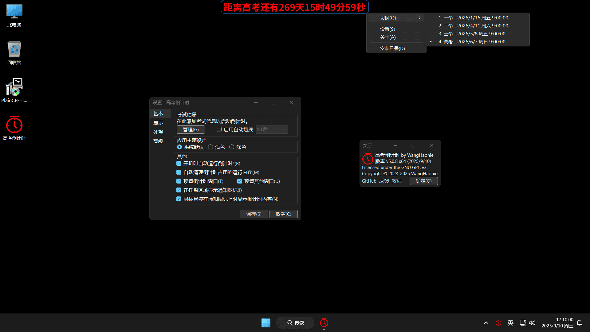

<h4>⚠️注意⚠️本程序完全免费, 且仅通过此 GitHub 仓库进行发布。任何其他网站或个人提供的下载链接均未获得授权, 可能存在安全风险及功能不完整。为了保障您的权益, 请直接从此仓库获取软件及其最新版本。支持正版, 拒绝盗版！<a href="https://github.com/WangHaonie/PlainCEETimer/issues/new?template=3-report-pirate.yml" target="_blank">举报盗版</a></h4>

    
    <h2>高考倒计时 by WangHaonie</h2>

    

## 📖 简介
PlainCEETimer, 一个纯粹的高考倒计时, 适用于 Windows 平台, 支持自定义考试名称和时间等。

> [!IMPORTANT]
> 本项目原名 [CEETimerCSharpWinForms](https://github.com/WangHaonie/CEETimerCSharpWinForms/), 当前最新版 v3.0.8 及以前仍使用原名, 新名将在 v3.0.9 及以后被应用。

## 📷 运行截图
> v3.0.8, Windows 11, 1920x1080, 125% 缩放

## 🔥 主要功能
+ 🔥 自定义考试名称
+ 🔥 自定义考试开始/结束日期时间
+ 🔥 自定义倒计时字体颜色、大小
+ 🔥 自定义不同时刻的倒计时内容格式、颜色等
+ 🔥 支持添加多个考试，以及自动/手动切换进行倒计时 **【v3.0.9 即将推出】**
+ 🔥 顶置显示倒计时
+ 🔥 防误关闭倒计时
+ 🔥 <更多功能等你来探索>

## ✨ 其他功能
+ ✅ 可拖动、固定倒计时
+ ✅ 禁止多开
+ ✅ 一键开机自启
+ ✅ 深色 UI 支持 **(Win10 1903 及以上)** **【v3.0.9 即将推出】**
+ ✅ 托盘图标 **【v3.0.9 即将推出】**
+ ✅ 后台内存自动清理
+ ✅ 启动时自动检查更新，确认后自动安装
+ ✅ 与网络同步系统时钟
+ ✅ <更多功能等你来探索>

## 📢 用户手册【墙裂建议先阅读再使用】
+ 适用于 v3.0.9，2025/4/13 修订。[点此](./.github/Manual.md)进入。

## 🧑‍💻 正在开发
+ 查看开发进程。[点此](./.github/InProgress.md)进入。

## 💻 开发环境
+ Windows 11 Pro x64 (26120.3863)
+ Visual Studio 2022 (17.13.6)
+ .NET Framework (4.8)
+ WinForms
+ C# (13.0 Preview)
+ C++ 17 (Toolset v143)

## ⚖️ 开源许可证
Both **PlainCEETimer** and **CEETimerCSharpWinForms** are licensed under the **GNU General Public License v3.0 (GPL-3.0)**.

## 🔗 其他链接
[CSDN 博客](https://blog.csdn.net/WHNdeCSDN/article/details/139425056)

## 💖 打赏作者
[传送门](https://wanghaonie.github.io/reward/reward.jpg)
